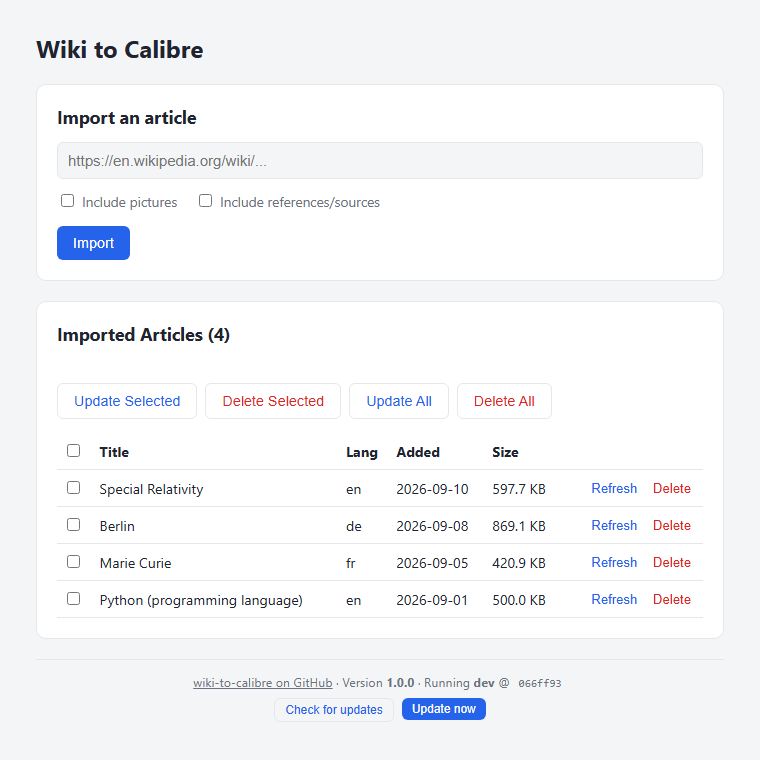

# wiki-to-calibre

A tiny, dependency-free web app that converts Wikipedia articles into clean
EPUBs and adds them straight to a [Calibre](https://calibre-ebook.com/)
library. Paste an article URL, get a readable ebook — infobox kept, navboxes
and citation clutter stripped, no re-downloads of articles you already have.

Built as a single Python 3 stdlib script (`http.server`, `html.parser`) — no
`pip install` required, just Python 3 and Calibre's command-line tools.

Works with any Calibre library, but pairs especially well with
[Calibre-Web Automated](https://github.com/crocodilestick/Calibre-Web-Automated) —
point `LIBRARY` at the same library folder CWA uses and imported articles show
up there immediately, with CWA's own auto-conversion/metadata features layered
on top.



## Features

- Converts any `*.wikipedia.org` article to EPUB via Calibre's `ebook-convert`
- Strips Wikipedia UI chrome (navboxes, edit links, hatnotes, maintenance
  banners) while keeping the infobox
- Optionally strips whole back-matter sections (References, Sources,
  Bibliography, External links, etc.) — recognizes English, German, and
  French section headings; warns if the article is in another language
- Optional inline images (downloaded and embedded, off by default)
- Skips re-importing an article that's already in the library
- A catalog view of everything imported, with per-article delete
- Per-article and bulk "refresh" (re-fetch + re-convert in place), remembering
  each article's image/reference options from its original import
- An About section showing the current version number plus exactly which
  branch and commit is running, with a "Check for updates" button and an
  "Update now" button that pulls the latest code for whichever branch you're
  on and restarts itself — no SSH session required for routine updates

## Requirements

- Python 3.9+
- Calibre installed with `ebook-convert` and `calibredb` on `PATH`
- A Calibre library (a folder containing `metadata.db`, created automatically
  on first import if it doesn't exist yet)
- `git` — the installer clones the repo into place rather than dropping a
  standalone script, so the in-app "Check for updates" / "Update now"
  buttons have something to pull from

## Quick install

Interactive installer — checks for Python/git/Calibre (offers to `apt
install` what's missing), asks for your library path/port, clones the repo
into an install directory, and optionally sets up a systemd service:

```bash
bash -c "$(curl -fsSL https://raw.githubusercontent.com/Boisti13/wiki-to-calibre/main/install.sh)"
```

Or clone the repo first and run `./install.sh` locally — it copies your
local clone into place instead of cloning from GitHub again. Re-running the
installer against an existing install pulls the latest commit on whichever
branch is already deployed and restarts the service.

## Manual setup

`LIBRARY`, `PORT`, and `LIBRARY_URL` are read from the environment
(`WTC_LIBRARY`, `WTC_PORT`, `WTC_LIBRARY_URL`), falling back to the defaults
at the top of `import_wiki.py` if unset. Environment variables, not edits to
the source file, are the intended way to configure a git-checkout install —
the "Update now" button does a `git reset --hard`, which would otherwise
wipe any values hand-edited into the tracked file.

```bash
WTC_LIBRARY=/path/to/your/calibre/library \
WTC_PORT=8084 \
WTC_LIBRARY_URL=http://your-calibre-web-host:8083 \
python3 import_wiki.py
```

Open `http://localhost:8084`, paste an article URL, and import.

To run it as a systemd service, set the three `Environment=` lines in the
unit and point `ExecStart` at `python3 /path/to/import_wiki.py` (this is
exactly what `install.sh` generates).

## Licensing

**Code:** this repository is [MIT licensed](LICENSE).

**Calibre:** `ebook-convert` and `calibredb` are external tools this script
shells out to — they are not bundled or redistributed here. Calibre itself is
licensed under the [GPLv3](https://github.com/kovidgoyal/calibre/blob/master/LICENSE)
and must be installed separately.

**Wikipedia content:** article text fetched via this tool comes from the
[Wikimedia REST API](https://www.mediawiki.org/wiki/Wikimedia_REST_API) and is
licensed under
[CC BY-SA 4.0](https://creativecommons.org/licenses/by-sa/4.0/) (with
contributions also available under the GFDL). Every EPUB this tool generates
includes an attribution footer linking back to the source article and its
contributor history, satisfying the attribution requirement. If you
redistribute EPUBs generated by this tool, you are responsible for complying
with CC BY-SA — in particular, keeping that attribution intact and
share-alike licensing of any derivative text. This project is not affiliated
with or endorsed by the Wikimedia Foundation.
